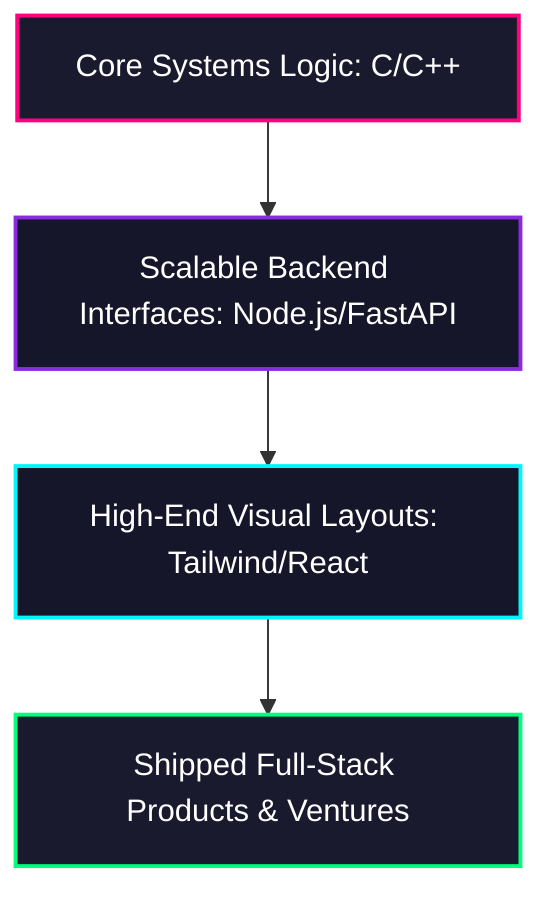
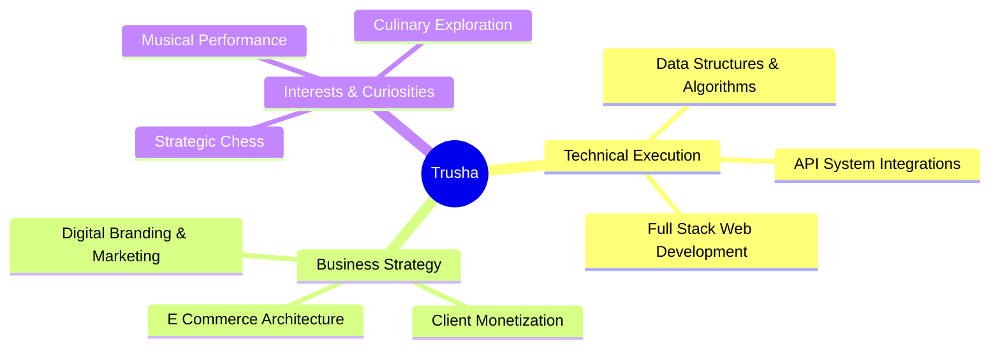

# ✦ TruCoded

  

  <strong>Hi, I'm Trusha. An engineering student focused on the intersection of software development, entrepreneurship, and design.</strong> 
  <em>I engineer digital products, explore startup frameworks, and design visual systems for businesses and high-growth projects. Most people study syntax; I build functional full-stack platforms and run an independent digital creative engine.</em>

  
  
  

---

### Execution Framework

*   **The Technical Approach:** I do not collect un-compiled theoretical syntax. I deploy functional prototypes using generative intelligence arrays, then reverse-engineer the underlying code mechanics to master core computer science and algorithms.
*   **The Commercial Approach:** I operate a monetized graphic design, digital branding, and marketing business dealing directly with clients. I believe in becoming a well-rounded engineer by connecting technical logic straight to business strategy and active production loops.

---

### Core Technology Matrix

| Layer | System Domain & Capabilities |
| :--- | :--- |
| **Logic Engines** | Low-level execution optimization, runtime constraints mapping, pointer structures, data manipulation. |
| **Interface Networks** | Asynchronous API streaming, state hydration, dynamic rendering pipelines, modular layout geometry. |
| **Creative Systems** | Vector graphics forging, visual hierarchy engineering, user acquisition strategies, client monetization. |

---

### ◈ Current Project Matrix

| System Platform | Core Stack Architecture | Operational Pipeline | Verification Metrics |
| :--- | :--- | :--- | :--- |
| **Codeyy** | `Next.js` · `Node.js` · `Express` · `OCR Engine` | Live Line-by-Line Syntax Code Analysis Suite | [Production Active](https://vercel.app) |
| **ResilioGate AI** | `Python` · `Pandas` · `ML Ensembles` · `React` | Multi-Layer Perceptron Supply Chain Gating Switchboard | [Hackathon Track Active] |
| **LayeredUpp E-Com** | `Tailwind CSS` · `Shopify API` · `Gumroad Engine` | Independent Monetized Digital Property Framework | [Live Commercial Deploy](https://beacons.ai) |

---

### Active Production Shipped

#### ◈ Codeyy — AI-Powered Developer Intelligence Platform
*   **The Architecture:** A fully functional developer analytics suite hosted on the Vercel edge network. Ingests raw snippets or multi-format screenshots via a fast image OCR engine to run isolated logic diagnosis.
*   **The Leverage:** Automates structural programming language detection, maps sequential line-by-line execution loops, tracks dry runs, and converts algebraic time/space complexities across 30+ production languages.
*   **Pipeline:** `React Engine` · `Tailwind CSS Framework` · `Node.js Server` · `Google Gemini API Studio`
*   🔗 **Run Mainframe:** [codeyy-gamma.vercel.app](https://vercel.app)

#### ◈ ResilioGate AI — Adaptive Supply Chain Routing Engine
*   **The Architecture:** A synchronized predictive forecasting matrix engineered under the Swiss-Indo research framework to resolve non-stationary distribution breaks across massive time-series datasets.
*   **The Leverage:** Completely replaces blind, static percentage averages with a native Multi-Layer Perceptron gating network running on vectorized data context, reporting metrics across separate stable and volatile profiles.
*   **Pipeline:** `Python Analytics` · `Pandas Vector Slicing` · `Node.js Pipeline` · `React Dashboard Interface`

---

### Multi-Dimensional Focus

---

### System Performance & Diagnostics

  
  

  

